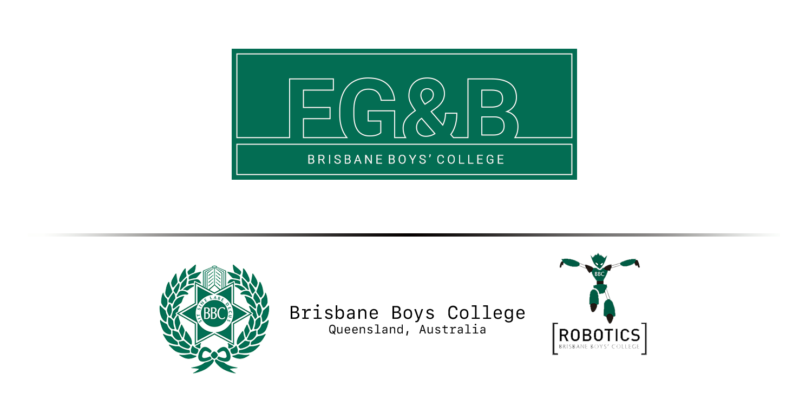

# **FG&B** Repo For 2018

**The Team:** Alistair English, Thomas Fraser, Tom Hulbert, Cooper Richmond, William Plummer

-------------------------------------------------------------

[FG&B Robotics](https://fg-b.github.io)

For enquiries relating to BBC Robotics please visit:
[Brisbane Boys' College Website](http://www.bbc.qld.edu.au)

For enquiries relating to this repo please contact: tr.fraser@bigpond.com

## 2018 Roadmap
#### Before Internationals
- [x] **Power on PCB**
- [x] **Make Motors Move**
- [x] **Communicate to Camera and Follow Ball**
- [x] **Line Avoidance & Goal Tracking**
* Other Abilities
    - [x] **Kicking**
    - [x] **Dribbling**
    - [x] **Laser Range Finders**
    - [x] **Ball Hiding** (technically)
    - [x] **Play single track music by manipulating PWM frequencies**
    - [ ] **Play multi track music by manipulating PWM frequencies (1 track per motor)**

#### At Internationals
- [x] Win

## International Results
- **Individual:** 3rd
- **Superteam:** 1st (With China, Russia, Slovenia & Japan)

